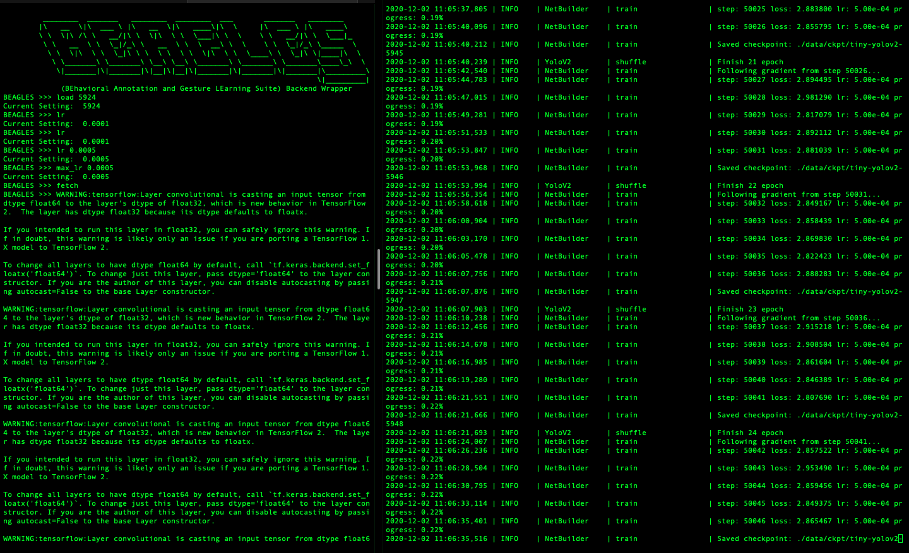

################
What is BEAGLES?
################

BEAGLES stands for BEhavioral Annotation and Gesture LEarning Suite,
and is intended for behavioral analysis and quantification of video data.
The image annotation GUI was originally forked from `labelImg <https://github.com/tzutalin/labelImg>`_
and the machine learning backend is based on `darkflow <https://github.com/thtrieu/darkflow>`_
but converts `darknet <https://pjreddie.com/darknet/>`_ configuration files to
TensorFlow 2 networks. Backend functionalities like training, prediction, video
annotation/quantification can be accessed from the GUI as well as from an
interactive command shell or the BEAGLES API itself.

############
Installation
############

In the directory you would like to build BEAGLES:

.. code-block:: bash

	# clone the repo
	git clone https://github.com/rjdbcm/BEAGLES.git

	# move to the build-tools directory
	cd BEAGLES/dev/build-tools/

	# run the build script
	./build-venv.sh

	# move to the repo root and run make
	cd ../../
	make

.. note:: This will install `Homebrew <http://brew.sh>`_ on MacOS.
