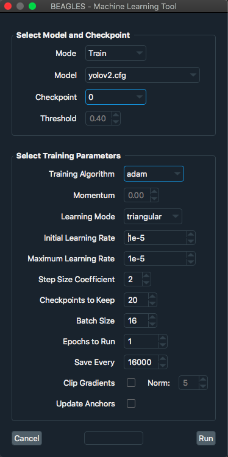
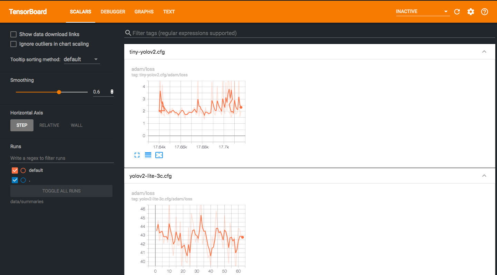

##################
Keyboard Shortcuts
##################

===============  ================================================
**Shortcut**     **Action**
---------------  ------------------------------------------------
:kbd:`Ctrl ⇧ a`  Toggle advanced mode toolbar
:kbd:`Ctrl =`    Zoom in
:kbd:`Ctrl -`    Zoom out
:kbd:`Ctrl i`    Choose a video to import frames for annotation
:kbd:`Ctrl u`    Choose a directory to load images from
:kbd:`Ctrl r`    Change the default annotation directory
:kbd:`Ctrl s`    Save
:kbd:`Crtl d`    Duplicate the selected label and bounding box
:kbd:`Ctrl t`    Open machine learning interface
:kbd:`space`     Flag the current image as verified
:kbd:`w`         Create a new bounding box
:kbd:`d`         Next image
:kbd:`a`         Previous Image
:kbd:`delete`    Delete the selected bounding box
:kbd:`↑→↓←`      Move the selected bounding box
===============  ================================================

#################
Annotating Images
#################

**********************
Importing Video Frames
**********************
On the BEAGLES menu bar use :any:`File → Import Video Frames`
or press :kbd:`Ctrl i`.

.. figure:: .static/import-video-dialog.png
	:class: with-shadow
	:target: _images/import-video-dialog.png

	This will import video frames to :file:`data/rawframes/test/` using ffmpeg.

################
Training a Model
################

***********************
Machine Learning Dialog
***********************

	About to train a YOLOv2 model.

*******************
Monitoring Progress
*******************
On the BEAGLES menu bar use :obj:`Machine Learning → Visualize Model`.
This will open TensorBoard in the default web browser for your system.

Or just navigate to: `<http://localhost:6006>`_

#########
Recording
#########

***********************
Tiled Captures with OBS
***********************

1. Add camera sources.

2. Calculate the number of tiles :math:`T=\left\lceil \sqrt{N} \right\rceil^{2}`; N = number of cameras

